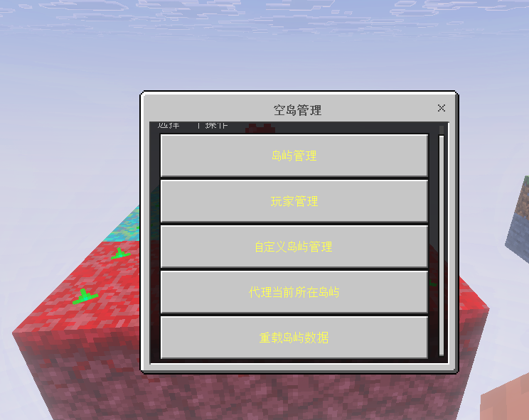
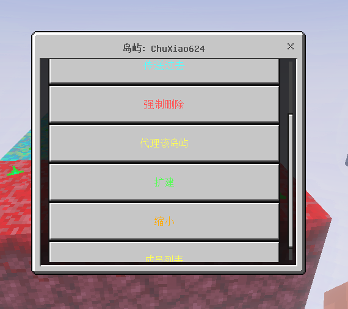
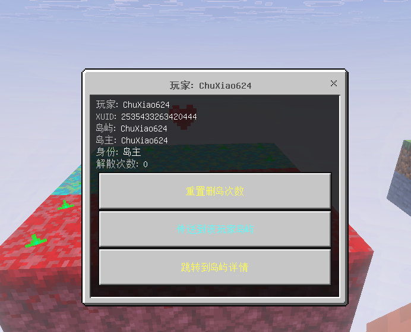

# 管理员命令 /isa

`/isa` 是本插件管理玩家/岛屿的命令

## 指令 (需要OP权限)

```
/isa admin add <玩家名>    # 添加
/isa admin del <玩家名>    # 移除
/isa admin list            # 查看列表
```

`admins` 列表存的是 xuid。**OP 不等于管理员**

## 命令一览

| 命令 | 作用 |
| --- | --- |
| `/isa` | 打开管理员 GUI 主菜单 |
| `/isa here` | 打开"你脚下所在岛"的详情 GUI |
| `/isa sudo` | 以成员身份进入脚下所在岛屿 |
| `/isa sudo <玩家>` | 以成员身份进入该玩家所在的岛屿 |
| `/isa sudo exit` | 退出代理状态 |
| `/isa expand <玩家> <格数>` | 把该玩家岛屿四个方向各扩展 N 格 |
| `/isa shrink <玩家> <格数>` | 把该玩家岛屿四个方向各缩小 N 格 |
| `/isa create` | 打开自定义岛屿创建 GUI |
| `/isa admin add / del / list <玩家>` | 管理员名单维护 |
| `/isa reload` | 重载 skyblock 插件（`ll reload skyblock`） |

## 主菜单 GUI

`/isa` 不带子命令时弹出



| 按钮 | 跳转 |
| --- | --- |
| `岛屿管理` | 列出所有普通岛屿，搜索 / 翻页 / 详情 |
| `玩家管理` | 列出所有玩家（来源于 `playerinfo` 缓存），搜索 / 操作 |
| `自定义岛屿` | 创建 / 管理无 owner 的特殊岛屿 |
| `代理当前所在岛` | 等价于 `/isa sudo` |
| `重载插件` | 等价于 `/isa reload` |

## 岛屿管理 GUI

每页 8 个岛屿，按钮文字格式 `岛屿名 - 成员数\n岛主名`。点开岛屿详情：



| 详情按钮 | 作用 |
| --- | --- |
| `传送到岛屿` | 直接 TP 到岛主出生点 |
| `强制删除` | 二次确认后删除岛屿，**不计入岛主解散次数** |
| `代理 (sudo)` | 进入该岛屿的代理状态 |
| `扩建 / 缩小` | 弹出输入框，输入扩缩格数 |
| `成员列表` | 进入成员管理 |

成员管理点某个成员后：



| 按钮 | 作用 |
| --- | --- |
| `重置解散次数` | 清零该玩家累积的解散次数 |
| `传送到他的岛` | TP 到该玩家所在岛 |
| `打开该岛详情` | 跳到岛屿详情 |
| `强制转让岛主` | 将岛主转给该成员（仅当目标不是岛主时显示） |
| `强制踢出` | 把该成员从岛屿移除（仅当目标不是岛主时显示） |

## 玩家管理 GUI

玩家列表的数据来源：`playerinfo` 扩展的缓存。**只有上线过的玩家**才会出现。

每页 8 个玩家，标签 `[有岛]` / `[无岛]` 区分。

## 扩缩岛屿

`/isa expand <玩家> <N>` 等价于在岛屿 GUI 里输 N。

- 实际扩张量 = 边长 **+ 2N**（四个方向各 +N）。
- 缩小同理 = 边长 **− 2N**。
- 缩小后的最小边长是 16。
- 岛屿大小切勿超出岛屿间隔

::: warning 缩小不会清理范围外的方块
缩小只是把岛屿的判定范围变小，已经放在外面的方块不会消失。需要先让玩家自行清理。
:::

::: warning 删除玩家的岛屿也不会清理方块
删除岛屿只是删除数据, 并不会清理方块 , 防止玩家误操作
:::

## reload 的注意点
