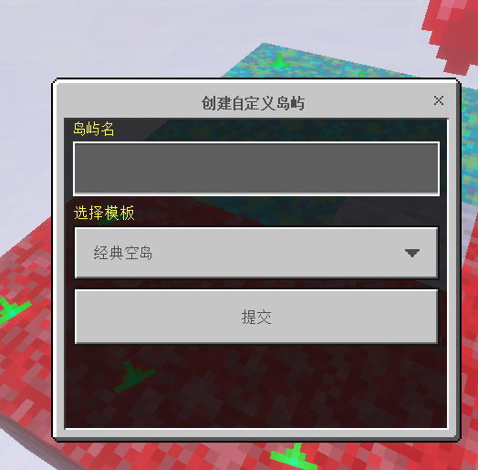
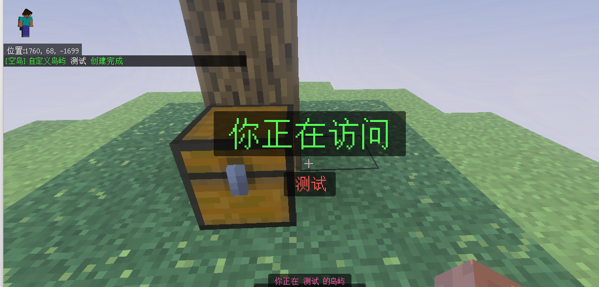
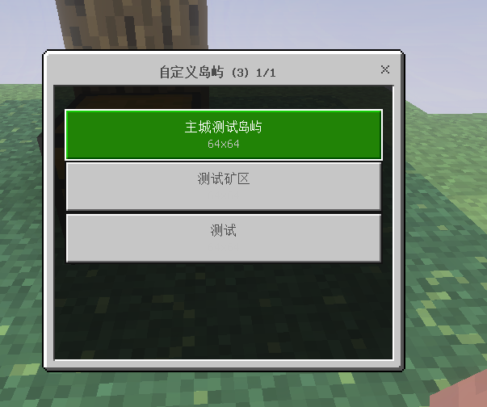
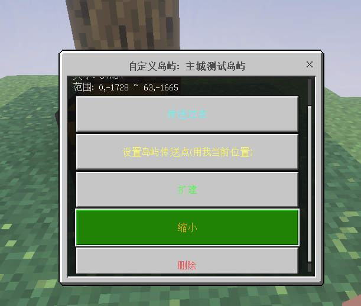

# 自定义岛屿

**自定义岛屿** 是一种特殊岛屿，**没有岛主**（`owner = null`），通常用于主城、活动场地、公共建筑等不属于任何玩家的区域。

## 创建自定义岛屿

::: code-group

```bash [GUI 方式]
/isa
# → 自定义岛屿 → 创建
# → 填名称 + 选模板
```

```bash [命令方式]
/isa create
# 直接弹出创建表单
```



:::

填名称（≤ 32 字符）、选模板，确认后会：

1. 分配下一个螺旋坐标。
2. 把你 TP 到新岛屿位置。



## 自定义岛屿管理 GUI

`/isa` → `自定义岛屿` → `查看列表`，每条按钮显示 `名称\n尺寸`。点详情：





| 按钮 | 作用 |
| --- | --- |
| `传送过去` | TP 到岛屿出生点 |
| `设置出生点` | 把你当前位置设为该岛屿的出生点 |
| `扩建 / 缩小` | 同普通岛屿 |
| `删除岛屿` | 二次确认后删除 |

## 你可以使用 /isa sudo 代理自定义岛屿 , 修改该岛屿的权限

自定义岛屿权限判定时会直接走 **该岛屿自己的 `defaults`**。
