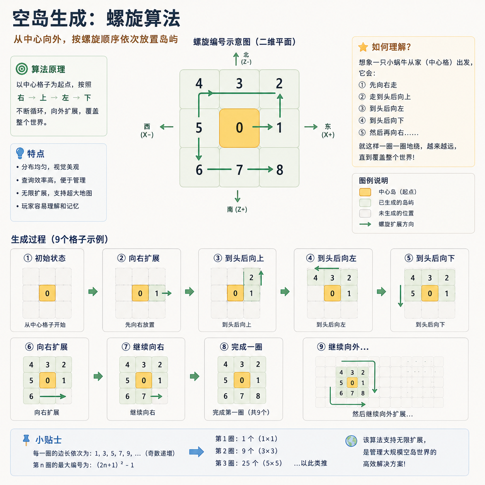

# 安装

本插件 基于 **LSE** 插件，需要先在 BDS 上配好 LeviLamina 与 LSE。

## 前置依赖

| 依赖 | 说明 |
| --- | --- |
| [BDS](https://www.minecraft.net/zh-hans/download/server/bedrock) | 基岩版官方服务端 |
| [LeviLamina](https://github.com/LiteLDev/LeviLamina) | BDS 加载器 |
| [legacy-script-engine-quickjs](https://github.com/LiteLDev/LegacyScriptEngine) | 必需的脚本引擎依赖 |
| [skyblock-nether](https://www.minebbs.com/resources/skyblock-nether-bridge.16377/) | 下界作为玩家岛屿的前置(可选) |


## 安装插件

把整个 `skyblock` 目录放到 BDS 的 `plugins/` 下，最终结构如下：

```
<BDS 根目录>/
├─ bedrock_server.exe
├─ plugins/
│  └─ skyblock/
│     ├─ manifest.json
│     ├─ skyblock.js          # 入口
│     ├─ src/                 # 内部代码
│     │  ├─ api/
│     │  ├─ core/
│     │  ├─ services/
│     │  ├─ repos/
│     │  └─ modules/
│     ├─ plugins/             # 第三方扩展放这里
│     ├─ templates/           # .mcstructure 模板源文件
│     ├─ lang/                # 多语言 (zh_CN.json / en_US.json)
│     ├─ config/              # 全局配置（提交进 git 作示例）
│     └─ data/                # 运行时数据（首次启动自动生成）
```


## 首次启动

启动 BDS，观察控制台。正常情况下你会看到这样的日志：

```
Bootstrap => 已同步 N 个 .mcstructure 模板
Bootstrap => 已加载 N 个扩展
IslandService => 已构建空间索引 0 个岛屿
Boot => skyblock 已就绪 !
```

启动完成后，`plugins/skyblock/` 下会生成 `config/`（全局配置）和 `data/`（运行时数据）两个目录：

| 文件 | 用途 |
| --- | --- |
| `config/config.json` | 全局配置 |
| `config/permissions.json` | 各维度的全局保护策略 |
| `data/islands.json` | 所有岛屿数据 |
| `data/index.json` | `xuid → islandId` 反查索引 |
| `data/coord.json` | 螺旋坐标分配器的当前状态 |
| `data/warps.json` | 所有传送点 |
| `data/permissions.json` | 每个岛屿的权限配置（defaults / allowlist / events） |
| `data/admin_proxy.json` | 管理员代理状态 |

::: warning 不要手动修改 coord.json
螺旋坐标是按"开服以来创建的总岛屿数"递推的。手动改它会导致后续岛屿与已有岛屿坐标冲突。如果想换初始坐标 / 间隔，**必须在创建第一个岛之前** 改 `config.json` 的 `island` 字段。
:::


## 岛屿生成示意图


## 下一步

- 调整全局参数：[全局配置](./configuration)
- 调整无主之地的权限：[全局保护策略](./permissions-config)
- 自定义岛屿模板：[模板概念](./templates)
- 设置管理员：在游戏内执行 `/isa admin add <玩家名>`
