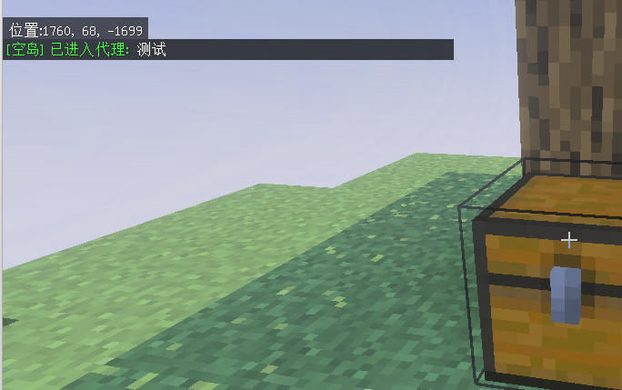

# 管理员代理 (sudo)

`sudo` 是 本插件添加的 岛屿管理机制：让管理员以 **岛主身份** 进入他人岛屿，配合 `/is perm` 等命令完成维护任务，操作完毕一键退出。

## 什么情况下需要 sudo

1. 你需要修改玩家的岛屿权限 / 设置
2. 你需要修改自定义岛屿的权限 / 设置

代理岛屿后, 你等于这个岛屿的主人

## 进入代理

::: code-group

```bash [按玩家名]
/isa sudo <玩家名>
# 进入该玩家所在岛屿（即使玩家不在线也行）
```

```bash [按当前位置]
/isa sudo
# 进入你脚下所在的岛屿
```

```bash [从 GUI]
/isa → 岛屿管理 → 选岛 → 代理 (sudo)
```


:::

进入成功后：

- 把你 TP 到该岛屿出生点
- 把你的 respawn 设置到该岛屿出生点
- 你会被加入该岛屿的 members（**仅在代理期间**）
- 提示 `已进入 <岛屿名> 的代理`

## 在代理中能做什么

代理期间你被视为该岛屿的 **岛主** 可以：

- `/is perm edit` 改默认权限
- `/is perm allowlist` 管理白名单玩家
- `/is invite <玩家>` 邀请玩家加入（如果你想"代加好友"）
- `/is setspawn` 改岛屿出生点
- `/is transfer` 转让岛主
- `/is disband` 解散岛屿（**不计入原岛主的解散次数**）

## 退出代理

::: code-group

```bash [命令]
/isa sudo exit
```

:::

## 不能进入的情况

| 情况 | 错误码 |
| --- | --- |
| 已经在代理中 | `already_in_proxy` |
| 目标岛屿不存在 | `no_island` |
| 目标岛屿是你自己的岛 | `self_island` |
| 目标岛主就是你 | `self_island` |
| 你已经是该岛成员 | `already_member` |