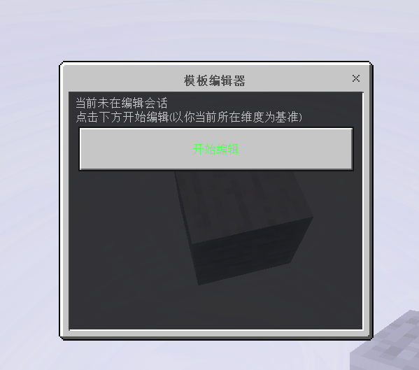
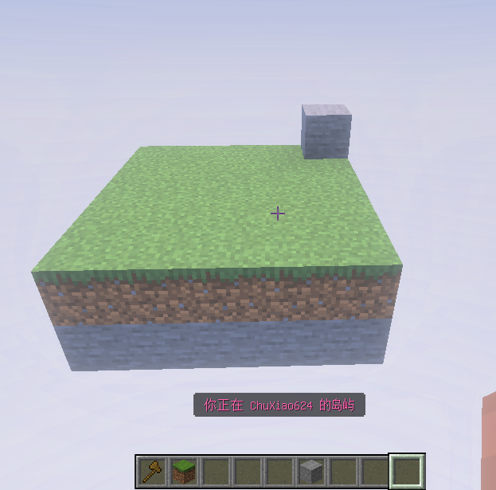
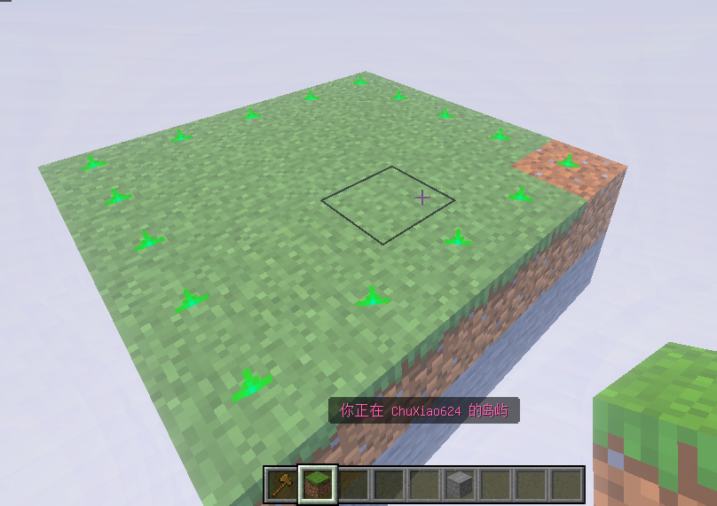
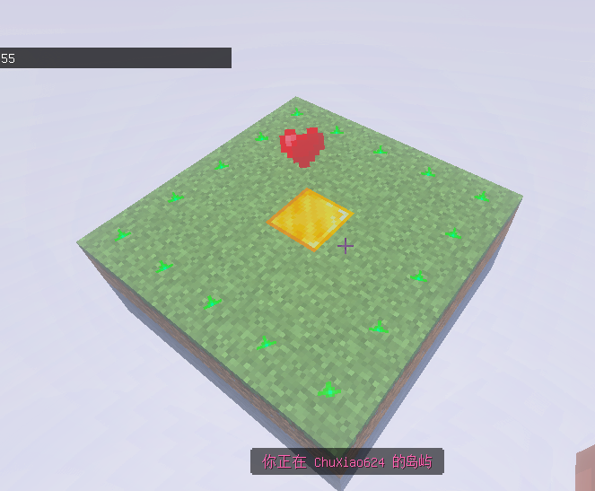
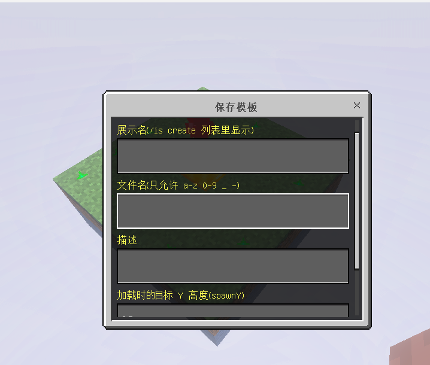
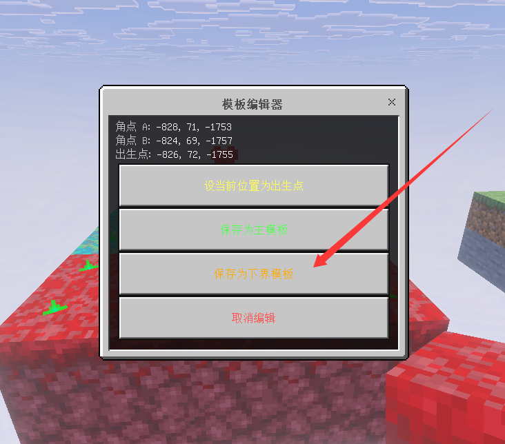
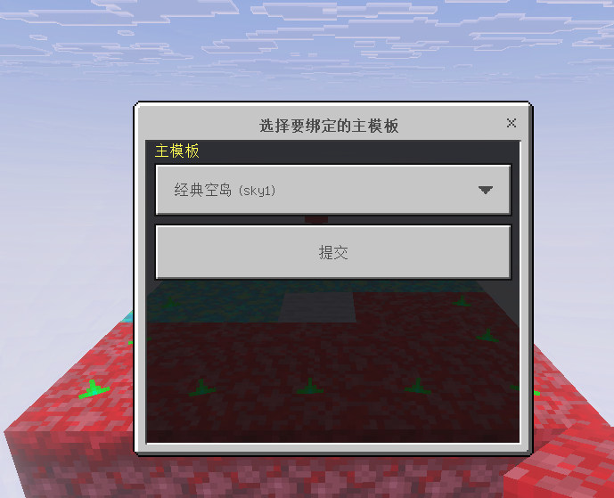

# 添加自定义模板

在游戏内输入  `/tpl` 即可打开 模板创建的GUI

## 准备

- 你必须是管理员（`/isa admin add <你的名字>`）。
- 在主世界 / 下界搭好你想保存为模板的结构。
- **手持一把木斧**（`minecraft:wooden_axe`）。

## 完整流程

### 1. 进入游戏

```
输入指令:  /tpl  在弹出的GUI 中点击 开始编辑
```



### 2. 建造你的岛屿模板



这里我以一个5*5的 小矩形作为演示

手持木斧，选区的两个对角：

| 操作 | 角点 |
| --- | --- |
| **破坏方块**（左键） | `pos1` |
| **右键使用方块**（右键） | `pos2` |

两个角都选完后，**绿色粒子框** 会自动绘制出选区边界



### 3. 设置出生点

走到你想让新玩家出生的位置（必须在选区内），

例如这里我希望玩家出生在 , 中间 我放置的金块上 , 那么就站在金块上方 输入 `/tpl` 菜单点击 `设置出生点`。

出生点会显示为 **红色爱心粒子**。



### 4. 保存主模板

输入 `/tpl` 点 `保存模板`，弹出 GUI 填写里面的字段

| 输入项 | 说明 |
| --- | --- |
| 名称 | 玩家创岛 GUI 中显示的名字 |
| 文件名 | `.mcstructure` 文件名（仅小写字母 / 数字 / `_` / `-`） |
| 描述 | GUI 中显示的描述 |
| 出生 Y 坐标 | 决定下界 / 主世界中模板的初始 Y |



### 5. 添加下界模板

重复上述操作 , 在保存的时候 选择保存下界模板



在弹出的GUI 中绑定主模板即可



下界模板会以 `<主模板file>_nether` 命名，写入主模板条目的 `nether_template` 字段。

::: warning 主模板必须先存在
保存下界模板时主模板必须已经在 `templates` 数组中，否则会失败。
:::